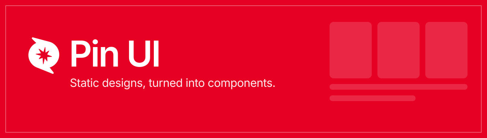

<p align="center">
  
</p>

<p align="center">
  <a href="https://pinui.xyz"><b>pinui.xyz</b></a>
  &nbsp;·&nbsp;
  <a href="https://in.pinterest.com/rachitrampage23/pin-ui/">the board</a>
  &nbsp;·&nbsp;
  <a href="https://x.com/RachitThakur146">@RachitThakur146</a>
</p>

<p align="center">
  
  
  
  
  
</p>

---

## The idea

Pinterest is full of interface design that never becomes interface. Someone
draws a beautiful card, a hundred people save it, and that is where it stops —
a still image of something that was meant to move.

**Pin UI takes pins off that board and finishes them.** Each one is rebuilt as a
real React component: animated, interactive, accessible, and small enough to
read in one sitting. You install it with a command you already have, and the
code that lands in your project is the same code running on the page you
installed it from.

Three components today. Three new ones every week.

---

## What is in the box

| Component | What it does | Install |
| :-- | :-- | :-- |
| **Selection List** | A session broken into blocks, counting down in real time. The track is a clock, not a progress bar. | `npx shadcn@latest add "https://pinui.xyz/r/session-list.json"` |
| **Balance Card** | A counting balance, a liquid currency selector and a drawer that settles. | `npx shadcn@latest add "https://pinui.xyz/r/balance-card.json"` |
| **Add To Cart** | A product card that is only a photo until you open it. | `npx shadcn@latest add "https://pinui.xyz/r/cart-card.json"` |

There is **no Pin UI CLI to install**, and that is deliberate. `shadcn`'s own
`add` command takes any URL that answers with a registry item, and every
component here is served as one. So the install command is a link, the registry
is four static JSON files, and there is no package of ours between you and the
source.

```bash
# npm · pnpm · bun · yarn — pick the one you already use
npx shadcn@latest add "https://pinui.xyz/r/balance-card.json"
pnpm dlx shadcn@latest add "https://pinui.xyz/r/balance-card.json"
bunx --bun shadcn@latest add "https://pinui.xyz/r/balance-card.json"
yarn dlx shadcn@latest add "https://pinui.xyz/r/balance-card.json"
```

Two files land in `components/pinui/` — the component and the stylesheet it
imports. The only runtime dependency is [Motion](https://motion.dev). The whole
shelf at once lives at [`/r/registry.json`](https://pinui.xyz/r/registry.json).

---

## Principles

Six rules the whole thing is built on. They are not decoration; every one of
them shows up in the code.

**1 · The demo is the source.**
Component pages read their own files off disk at build time and print them. The
registry JSON is built from the same read. Nothing can drift, because there is
only one copy.

**2 · Everything moves on a spring.**
No durations, no easing curves picked by eye. One set of spring tokens in
`lib/motion.ts` gives the whole interface a single physical character — the same
mass and damping behind a card entrance, a drawer settling and a mark flipping.

**3 · Sound is synthesised, never sampled.**
Every cue is a *struck string* — Karplus-Strong, solved in plain JavaScript into
an AudioBuffer. Noise is filtered into a pitch that starts bright and darkens as
it rings. No audio files ship, and nothing sounds like the sine blip every other
site uses.

**4 · Two themes, one gesture.**
The pin is the switch, wherever it appears. Light is crimson on white; crimson
is white on crimson. The choice is written to `<html data-pin-theme>` before
first paint, so there is no flash, and it follows you between pages.

**5 · One dial per surface.**
The page is sized in `em` off a single clamped root, so a composition scales as
one object instead of needing a breakpoint per element. Phones get their own
dial rather than the bottom of the desktop one.

**6 · Square corners on chrome.**
Structure is carried by hairline rules and 1px gaps, not rounded panels and
heavy shadows. The components keep whatever radii their own designs use — they
are artwork, the site is not.

---

## The site

| Route | What it is |
| :-- | :-- |
| `/` | The landing: masthead, a band of live component recordings, the shelf. |
| `/components/<slug>` | The workbench — one component running on its own stage, with its write-up, install command, props and full source underneath. |
| `/waitlist` | Progressive signup, ending in a generated access pass you can download or post. |
| `/privacy`, `/terms` | Written against what the code does, not from a template. |
| `/r/<slug>.json` | A shadcn registry item. Prerendered, CORS-open, cacheable. |
| `/r/registry.json` | The whole shelf in one document. |
| `/sitemap.xml`, `/robots.txt` | Generated from the real route list. |
| `/api/waitlist` | The only dynamic route in the project. |

Everything else is static or prerendered.

---

## Details worth knowing

**The band never stops.** The hero's recordings loop continuously and the track
is driven frame by frame rather than by a CSS animation — because slowing a CSS
animation recomputes its position from the original start time, so the strip
jumps the instant your pointer arrives. Holding the offset ourselves lets the
speed ease down instead. Hovering slows it to a crawl; it does nothing else.

**The Pinterest mark is a door.** Point at it anywhere in the copy and the board
these components came from opens on a card that trails your cursor on a spring.
It is built from the real recordings rather than embedded, because Pinterest
answers with `X-Frame-Options: DENY` and there is no live frame to be had.

**The mark travels.** Scroll past the hero and the masthead hands its lockup to
the rail through a shared `layoutId`, so the pin moves rather than fading out in
one place and in again in another. On a phone that rail lies down and becomes a
pill at the foot of the screen, where a thumb already is.

**The code panel opens downward.** Nothing on a component page covers the
component. The write-up and the source give up the bottom of the window and
arrive under the stage, so the thing you came to look at stays where it was.

**No signup data leaves the server.** The waitlist writes through a Supabase
`SECURITY DEFINER` function with row-level security on and zero table grants.
Only the publishable key is used, only server-side. There is no service-role key
anywhere in this repository.

---

## Running it

```bash
npm install
npm run dev     # http://localhost:3100
```

```bash
npm run build   # production build
npm start       # serve the build
```

Node 20.9 or newer.

### Environment

Every variable is optional — without them the site builds, runs and renders
identically; only the waitlist write is skipped.

| Variable | Used for |
| :-- | :-- |
| `NEXT_PUBLIC_SITE_URL` | Canonical origin for metadata, the sitemap and the install commands. Falls back to the Vercel URL, then to `https://pinui.xyz`. |
| `SUPABASE_URL` | PostgREST endpoint for the waitlist. Server-side only. |
| `SUPABASE_PUBLISHABLE_KEY` | Publishable key. Server-side only. Never the service-role key. |

The schema and the signup function live in [`supabase/migrations`](supabase/migrations).

---

## Layout

```
app/
├─ page.tsx                 the landing
├─ components/[slug]/       the workbench, one page per component
├─ r/[slug]/                registry items, prerendered to static JSON
├─ waitlist/ · privacy/ · terms/
├─ api/waitlist/            the one dynamic route
├─ hero.css · sections.css · globals.css
components/
├─ hero/                    masthead, band, rail, footer, Pinterest peek
├─ library/                 the three components, the registry, the workbench
├─ legal/                   the policy shell
lib/
├─ motion.ts                spring tokens — the whole site's physics
├─ sound.ts                 the Karplus-Strong string
├─ theme.ts                 the theme store, and the mark's turn count
├─ art.ts                   shared vector paths
├─ links.ts                 every off-site address, in one place
├─ registryItem.ts          components → shadcn registry items
└─ waitlist.ts              the Supabase client
public/
├─ clips/                   component recordings
├─ fonts/                   Inter & Inter Tight, self-hosted
└─ hero/ · library/
```

---

## Using the components

Every component published here is offered under the
[MIT licence](https://opensource.org/license/mit): copy them, change them, ship
them in work you sell, and you owe nothing and need not ask — keep the licence
notice with the code if you redistribute the components themselves. What that
does **not** cover is the Pin UI name and mark, or any photograph or recording
used to demonstrate a component. Those stay with their owners. The full wording
is on [the terms page](https://pinui.xyz/terms).

Each component is also a standalone project of its own:
[Balance-Card](https://github.com/Rachit315/Balance-Card) is the original build
of that one.

---

<p align="center">
  <sub>Built by <a href="https://github.com/Rachit315">Rachit</a> · found on
  <a href="https://in.pinterest.com/rachitrampage23/pin-ui/">Pinterest</a> ·
  <a href="https://pinui.xyz">pinui.xyz</a></sub>
</p>
